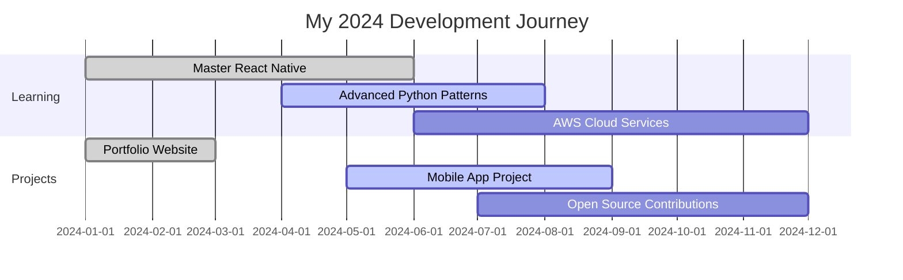

<div align="center">
  
</div>

<div align="center">
  
</div>

<h1 align="center">
  
  Ishani Ekanayake
  
</h1>

<p align="center">
  
  
  
</p>

<p align="center">
  <a href="https://port-folio-nine-mu.vercel.app/" target="_blank">
    
  </a>
  <a href="https://github.com/ishaniekanayake?tab=repositories" target="_blank">
    
  </a>
  <a href="mailto:ishaniekanayaka27@gmail.com">
    
  </a>
</p>

<div align="center">
  
</div>

<table align="center">
<tr border="none">
<td width="50%" align="left">

## 🚀 About Me

```javascript
const ishani = {
    pronouns: "She/Her",
    location: "Sri Lanka 🇱🇰",
    currentFocus: "Full Stack Development",
    learning: ["React Native", "Python", "Advanced Mobile Development"],
    workingOn: ["Personal Portfolio", "Open Source Projects"],
    askMeAbout: ["React Native", "Python", "Full Stack Development"],
    funFact: "I can solve Rubik's cube while coding! 🧩",
    goals2024: "Contribute to more open source projects"
};
```

- 🔭 Currently working on **React Native and Python projects**
- 🌱 Learning **advanced mobile development patterns**
- 👯 Looking to collaborate on **open source projects**
- 💬 Ask me about **React Native, Python, or full stack development**
- 📫 Reach me: **ishaniekanayaka27@gmail.com**
- ⚡ Fun fact: **I can solve Rubik's cube while coding!**

</td>
<td width="50%" align="center">
  
  
  <div align="center">
  
  
  
  
  
  </div>
</td>
</tr>
</table>

<div align="center">
  
</div>

## 🛠️ Tech Stack & Tools

<div align="center">

### 💻 Programming Languages
<p>
  
</p>

### 🌐 Frontend Development
<p>
  
</p>

### 📱 Mobile Development
<p>
  
  
  
</p>

### ⚙️ Backend Development
<p>
  
</p>

### 🗄️ Databases
<p>
  
</p>

### ☁️ DevOps & Cloud
<p>
  
  
</p>

### 🔧 Development Tools
<p>
  
  
</p>

</div>

<div align="center">
  
</div>

## 📊 GitHub Analytics

<div align="center">
   
  
</div>

<div align="center">
  
</div>

<div align="center">
  
</div>

### 📈 Weekly Development Breakdown
<div align="center">
  
</div>

### 🏆 GitHub Trophies
<div align="center">
  
</div>

### 📊 Contribution Graph
<div align="center">
  
</div>

<div align="center">
  
</div>

## 🌟 Featured Projects

<div align="center">
  <a href="https://github.com/ishaniekanayake/project1">
    
  </a>
  <a href="https://github.com/ishaniekanayake/project2">
    
  </a>
</div>

<div align="center">
  
</div>

## 🌐 Connect With Me

<div align="center">
  <a href="https://linkedin.com/in/ishani-ekanayake" target="_blank">
    
  </a>
  <a href="https://twitter.com/ishani_ekanayake" target="_blank">
    
  </a>
  <a href="https://medium.com/@ishani-ekanayake" target="_blank">
    
  </a>
  <a href="mailto:ishaniekanayaka27@gmail.com">
    
  </a>
  <a href="https://port-folio-nine-mu.vercel.app/" target="_blank">
    
  </a>
  <a href="https://github.com/ishaniekanayake" target="_blank">
    
  </a>
</div>

<div align="center">
  
</div>

## 📝 Latest Blog Posts

<!-- BLOG-POST-LIST:START -->
<div align="center">
  <a href="https://medium.com/@ishani-ekanayake/getting-started-with-react-native" target="_blank">
    
  </a>
</div>

<div align="center">
  <a href="https://medium.com/@ishani-ekanayake/python-best-practices" target="_blank">
    
  </a>
</div>

<div align="center">
  <a href="https://medium.com/@ishani-ekanayake/full-stack-development-journey" target="_blank">
    
  </a>
</div>
<!-- BLOG-POST-LIST:END -->

<div align="center">
  
</div>

## 🎯 Current Goals

<div align="center">



</div>

<div align="center">
  
</div>

<div align="center">
  <h3>
     
    Thanks for visiting my profile! 
    
  </h3>
  <p>
    
    
  </p>
  <p><em>Last updated: August 2025</em></p>
</div>

---

<div align="center">
  <sub>💙 This README was created with passion and lots of ☕</sub>
</div>
